# Breach Algorithm

## Overview

The breach algorithm removes depressions from a DEM by carving flow paths through elevation barriers. The algorithm reads the input DEM and writes a modified output DEM with lowered cell elevations that create monotonic drainage paths from pits to outlets.

The implementation uses two complementary strategies. First, a fast single-cell method handles simple pits by modifying one intermediate cell. Second, a Dijkstra-based least-cost pathfinding approach handles complex, multi-cell depressions that the single-cell method cannot resolve.

For large rasters, the algorithm processes the DEM in tiles. Each tile is read with a buffer region to ensure cells near tile edges can access their full neighborhood. Tiles are modified in memory, and only the unbuffered interior is written to the output.

## Mathematical Foundation

A cell $c$ with elevation $z_c$ is a **pit** if all 8-connected neighbors have elevation greater than or equal to $z_c$, and at least one neighbor is strictly higher:

$$
\text{is\_pit}(c) = \left(\forall n \in N(c): z_n \geq z_c\right) \land \left(\exists n \in N(c): z_n > z_c\right)
$$

where $N(c)$ denotes the 8-connected neighborhood. This definition excludes flat regions where all neighbors have equal elevation:

$$
\text{is\_flat}(c) = \forall n \in N(c): z_n = z_c
$$

A **breach path** is a sequence of cells $P = [p_1, p_2, \ldots, p_k]$ connecting a pit to a drainage point. The algorithm modifies elevations along this path to create monotonic descent.

## Data Types and Structures

### Input/Output Types

| Parameter | Type | Description | No-Data Value |
|-----------|------|-------------|---------------|
| input_dem | float32 | Input elevation raster | user-defined or NaN |
| output_dem | float32 | Output elevation raster with breached pits | user-defined or NaN |
| search_radius | int | Maximum search distance for least-cost paths (cells) | N/A |

### Internal Structures

| Structure | Type | Purpose |
|-----------|------|---------|
| unsolved_pits_raster | int8 2D array | Marks cells as pits (1) or solved/non-pit (0) |
| costs_array | float32 2D array | Accumulated path cost, size $(2r+1)^2$ per pit |
| prev_rows_array | int64 2D array | Row index of predecessor in path, size $(2r+1)^2$ per pit |
| prev_cols_array | int64 2D array | Column index of predecessor in path, size $(2r+1)^2$ per pit |
| Priority queue (heap) | GridCell list | Min-heap storing (cost, row, col) for Dijkstra's algorithm |

### Constants

| Constant | Value | Purpose |
|----------|-------|---------|
| EPSILON_GRADIENT | `1e-5` | Minimum elevation drop per cell when breaching to nodata |
| DEFAULT_SEARCH_RADIUS | `200` | Default maximum search distance for least-cost breaching (cells) |
| UNVISITED_INDEX | `-1` | Sentinel value indicating unvisited cell in path reconstruction |

## Algorithm

The breach algorithm operates in two phases. The single-cell phase handles simple pits quickly. Pits that remain unsolved are passed to the least-cost phase.

### Processing Model

The input DEM is divided into tiles for large rasters. For each tile, both breach phases are applied sequentially on the same in-memory data before writing to output:

1. Read tile from input (with buffer sized to search radius)
2. Apply single-cell breaching to the tile in memory (modifies tile data)
3. Apply least-cost breaching to the same modified tile in memory
4. Write the final result to output (unbuffered interior only)

The loop structure `for row in range(2, rows - 2)` processes cells starting at index 2 and ending at `rows - 3` (inclusive). This excludes the buffer on all edges. The same applies for columns. The buffer size for least-cost breaching equals the search radius to ensure pits near tile edges can search their full window.

Tiles are processed in parallel. Each tile operates on its own memory region, with both phases applied to the same tile data before writing.

### Phase 1: Single-Cell Pit Detection

The algorithm scans the interior region of each tile to identify pits. A cell is marked as a pit if all 8 neighbors have elevation greater than or equal to the cell, and at least one neighbor is strictly higher. Flat cells are explicitly excluded from being marked as pits.

```python
def identify_single_cell_pits(dem: float32[rows, cols], nodata_value: float) -> int8[rows, cols]:
    """Identify single-cell pits in interior region (excluding 2-cell border)"""
    unsolved_pits = zeros((rows, cols), dtype=int8)

    for row in range(2, rows - 2):
        for col in range(2, cols - 2):
            z = dem[row, col]
            if z == nodata_value or isnan(z):
                continue

            is_flat = True
            is_sink = True

            # Check 8-connected neighbors
            for (dy, dx) in NEIGHBOR_OFFSETS:
                zn = dem[row + dy, col + dx]
                if zn != z:
                    is_flat = False
                # Sink check: any neighbor lower or nodata breaks sink status
                if zn == nodata_value or isnan(zn) or zn < z:
                    is_sink = False
                    break

            if not is_flat and is_sink:
                unsolved_pits[row, col] = 1

    return unsolved_pits
```

!!! warning "Flat Cells Are Not Pits"
    Cells where all neighbors have equal elevation are explicitly excluded. Only true pits (all neighbors higher) and cells on the edge of a flat region (some equal, some higher, none lower) are marked as pits.

The function returns an int8 array marking pit cells. The nodata check occurs first. If a cell is nodata or NaN, it is skipped entirely. During neighbor checking, nodata neighbors are treated as being lower than the current cell elevation. This breaks the sink condition, so cells adjacent to nodata are not marked as pits. However, during resolution, nodata cells can be valid breach targets.

### Phase 2: Single-Cell Pit Resolution

For each identified pit, the algorithm searches a 16-cell neighborhood at radius 2 for a breach target. The target must have elevation less than or equal to the pit elevation, or be nodata. When a target is found, the intermediate cell between the pit and target is modified.

```python
def resolve_single_cell_pits(dem: float32[rows, cols],
                              unsolved_pits: int8[rows, cols],
                              nodata_value: float) -> int8[rows, cols]:
    """Breach pits within 16-neighbor window by modifying intermediate cell"""
    # 16-neighbor offsets at radius 2
    dx2 = [2, 2, 2, 2, 2, 1, 0, -1, -2, -2, -2, -2, -2, -1, 0, 1]
    dy2 = [-2, -1, 0, 1, 2, 2, 2, 2, 2, 1, 0, -1, -2, -2, -2, -2]
    # Intermediate cell mapping: breachcell[k] gives 8-neighbor index
    breachcell = [0, 0, 1, 1, 2, 2, 3, 3, 4, 4, 5, 5, 6, 6, 7, 0]

    pit_indices = argwhere(unsolved_pits == 1)

    for (row, col) in pit_indices:
        z = dem[row, col]
        for k in range(16):
            zn = dem[row + dy2[k], col + dx2[k]]

            # Breach target: lower or equal elevation, or nodata
            if zn <= z or zn == nodata_value or isnan(zn):
                if zn == nodata_value or isnan(zn):
                    # Breaching to nodata: apply small gradient
                    zn = z - 2 * EPSILON_GRADIENT

                # Modify intermediate cell
                intermediate = breachcell[k]
                dem[row + dy[intermediate], col + dx[intermediate]] = (z + zn) / 2
                unsolved_pits[row, col] = 0  # Mark as solved
                break

    return unsolved_pits
```

The intermediate cell elevation is set to the average of the pit and target elevations: $(z_c + z_t) / 2$. This ensures the intermediate cell is lower than the pit but higher than the target, preventing the creation of new pits or uphill flow segments.

When breaching to a nodata cell, the target elevation is set to $z - 2 \cdot \epsilon$. The factor of 2 ensures that when the intermediate cell takes the average $(z + (z - 2\epsilon))/2 = z - \epsilon$, the resulting elevation is below the pit by at least one epsilon. This guarantees flow can continue through the pit.

If no valid breach target is found within the 16-neighbor window, the pit remains in the unsolved_pits_raster with value 1. These pits are passed to the least-cost phase.

The `for (row, col) in pit_indices` loop iterates over all pits identified in phase 1. Within a single tile, `argwhere` returns indices in row-major order (top-to-bottom, left-to-right), so pit processing is deterministic. This loop executes sequentially (not parallelized within the tile).

### Phase 3: Least-Cost Path Breaching

Pits that remain unsolved after single-cell resolution are breached using Dijkstra's algorithm. The algorithm searches within a square window of size $(2r+1) \times (2r+1)$ centered on the pit, where $r$ is the search radius.

#### Cost Function

The cost to move from cell $c$ to neighbor $n$ is based on elevation difference relative to the pit elevation:

$$
\text{cost}(c \to n) = w_{c,n} \cdot (z_n - z_{\text{pit}})
$$

where $z_{\text{pit}}$ is the elevation of the pit cell (constant throughout the search), and $w_{c,n}$ is the distance weight:

$$
w_{c,n} = \begin{cases}
1.0 & \text{cardinal directions (N, S, E, W)} \\
\sqrt{2} & \text{diagonal directions (NE, NW, SE, SW)}
\end{cases}
$$

Descending terrain produces negative edge costs because $z_n < z_{\text{pit}}$. Dijkstra's algorithm handles negative costs correctly as long as there are no negative cycles. Paths preferentially follow valleys (negative costs accumulate to large negative total cost) rather than ridges (positive costs).

No-data cells are assigned elevation $-\infty$. When a neighbor is nodata, the edge cost calculation checks for this special value and uses zero cost instead of a very large negative number. This makes nodata cells strong attractors for breach paths without causing numerical overflow.

#### Dijkstra Search

```python
def breach_pit_least_cost(pit_row: int, pit_col: int,
                          dem: float32[rows, cols],
                          nodata_value: float,
                          search_radius: int) -> None:
    """Find and apply least-cost breach path using Dijkstra's algorithm"""
    initial_elevation = dem[pit_row, pit_col]

    # Initialize cost grid (size = search window)
    window_size = 2 * search_radius + 1
    costs = full((window_size, window_size), inf, dtype=float32)
    prev_rows = full((window_size, window_size), UNVISITED_INDEX, dtype=int64)
    prev_cols = full((window_size, window_size), UNVISITED_INDEX, dtype=int64)

    # Offsets to convert global coords to window coords
    row_offset = search_radius - pit_row
    col_offset = search_radius - pit_col

    # Initialize pit
    costs[pit_row + row_offset, pit_col + col_offset] = 0
    heap = MinHeap()
    heap.push((0.0, pit_row, pit_col))

    while not heap.empty():
        cost, row, col = heap.pop()

        # Check termination: found drainage point
        elevation = dem[row, col]
        if elevation == nodata_value or isnan(elevation):
            elevation = -inf
        if elevation < initial_elevation or elevation == -inf:
            # Reconstruct and apply path
            reconstruct_path(row, col, elevation, initial_elevation, dem,
                           prev_rows, prev_cols, row_offset, col_offset)
            return

        # Process 8-connected neighbors
        for direction in range(8):
            dy, dx = NEIGHBOR_OFFSETS[direction]
            nr, nc = row + dy, col + dx

            # Bounds check: within DEM and search window
            if not (0 <= nr < rows and 0 <= nc < cols):
                continue
            if abs(nr - pit_row) > search_radius or abs(nc - pit_col) > search_radius:
                continue

            # Calculate cost
            multiplier = sqrt(2) if is_diagonal(direction) else 1.0
            neighbor_elevation = dem[nr, nc]
            if neighbor_elevation == nodata_value or isnan(neighbor_elevation):
                neighbor_elevation = -inf

            if neighbor_elevation != -inf:
                edge_cost = multiplier * (neighbor_elevation - initial_elevation)
            else:
                edge_cost = 0  # No additional cost for nodata

            new_cost = cost + edge_cost

            # Update if better path found
            if new_cost < costs[nr + row_offset, nc + col_offset]:
                costs[nr + row_offset, nc + col_offset] = new_cost
                prev_rows[nr + row_offset, nc + col_offset] = row
                prev_cols[nr + row_offset, nc + col_offset] = col
                heap.push((new_cost, nr, nc))

    # No path found within search radius (pit remains)
```

The algorithm terminates when it pops a cell from the heap that has elevation less than the pit elevation, or is nodata. This cell is the breach point. If the heap empties without finding such a cell, the pit cannot be breached within the search radius and remains unmodified.

Each pit allocates its own cost and predecessor arrays of size $(2r+1)^2$. Different pits never share these arrays, even if their search windows overlap spatially in the DEM.

When multiple paths to a cell have the same cost, Dijkstra's algorithm selects whichever path reaches the cell first based on heap extraction order. All such paths are equally valid by the cost metric.

### Phase 4: Path Reconstruction and Gradient Application

Once a breach point is found, the path from the breach point back to the pit is reconstructed by following the predecessor pointers. The path is then used to apply a linear elevation gradient.

```python
def reconstruct_path(breach_row: int, breach_col: int,
                     final_elevation: float,
                     init_elevation: float,
                     dem: float32[rows, cols],
                     prev_rows: int64[window, window],
                     prev_cols: int64[window, window],
                     row_offset: int, col_offset: int) -> None:
    """Trace path and apply gradient"""
    # Build path from breach point to pit
    path = []
    row, col = breach_row, breach_col
    while prev_rows[row + row_offset, col + col_offset] != UNVISITED_INDEX:
        path.append((row, col))
        row = prev_rows[row + row_offset, col + col_offset]
        col = prev_cols[row + row_offset, col + col_offset]

    # Remove last cell (pit itself should not be modified)
    path.pop()
    path_length = len(path)

    # Apply gradient along path
    if final_elevation == -inf:
        # Case A: Breaching to nodata
        for j, (r, c) in enumerate(path):
            if j > 0:  # Skip first cell (already at breach point)
                gradient_elev = init_elevation - (path_length - j) * EPSILON_GRADIENT
                dem[r, c] = min(gradient_elev, dem[r, c])
    else:
        # Case B: Breaching to valid terrain
        for j, (r, c) in enumerate(path):
            # Skip flat areas (already at correct elevation)
            if dem[r, c] == init_elevation:
                continue
            # Linear interpolation from breach point to pit
            gradient_elev = final_elevation + (init_elevation - final_elevation) * j / path_length
            dem[r, c] = min(gradient_elev, dem[r, c])
```

The gradient is applied using linear interpolation between the breach point elevation and the pit elevation. The path list is ordered from breach point to pit (index 0 is breach point, last index is pit). The interpolation parameter $j / \text{path\_length}$ ranges from 0 at the breach point to 1 near the pit.

!!! danger "Always Use min() in Gradient Application"
    The min() operation `dem[r, c] = min(gradient_elev, dem[r, c])` is critical. It prevents raising elevations above their original values. This preserves ridges along the path and prevents the creation of uphill flow segments. Without min(), the gradient could raise cells that are already lower than the interpolated value, creating artificial barriers.

When breaching to nodata (final_elevation is $-\infty$), the gradient starts from the pit elevation and decreases by epsilon for each cell along the path away from the pit. The first cell in the path (the nodata cell itself) is skipped because it should not be modified.

When breaching to valid terrain, cells that already have elevation equal to the pit elevation are skipped. These are flat regions that should not be modified by the gradient. The path may traverse through such flats, and modifying them could create unintended barriers.

The pit cell itself is excluded from the path before gradient application (via `path.pop()`). The pit's original elevation is preserved.

### Multiple Pit Processing and Path Interactions

Within a single tile, pits are processed sequentially in row-major order (top-to-bottom, left-to-right). This ordering is deterministic because `argwhere` always returns indices in the same order for a given input.

When an earlier pit is breached before a later pit, the later pit's Dijkstra search operates on the DEM that already includes the earlier breach modifications. If an earlier pit creates a breach path that lowers terrain, later pits will see those lowered elevations during their cost calculations. A later pit may find a shorter or cheaper path by routing through terrain already lowered by an earlier breach, as the cost function naturally guides searches toward these lowered areas.

The `min()` operation in gradient application ensures that if multiple breach paths cross the same cell, that cell receives the minimum (most lowered) elevation from all breaches. Breaches only lower terrain, never raise it, so no conflicts occur between paths.

Different pit orderings could produce different final DEMs. However, row-major ordering is consistent across runs, making results fully reproducible. All breach paths remain valid (monotonically decreasing from pit to outlet) regardless of order.

This sequential processing within tiles is distinct from tile-level parallelism, where different tiles process independently and write to non-overlapping output regions.

## Visual Walkthrough

### Figure 1: Single-Cell Pit Detection Pattern

```
8-neighbor pit detection:

    Neighbor indices:     Elevation check:

     3  |  2  |  1           >= | >= | >=
    ----|-----|----         ----|----|----
     4  |  c  |  0           >= | zc | >=
    ----|-----|----         ----|----|----
     5  |  6  |  7           >= | >= | >=

    Pit: ALL neighbors >= zc AND at least one > zc

16-neighbor breach search:

     .  .  .  .  .
     .  x  x  x  .
     .  x  c  x  .
     .  x  x  x  .
     .  .  .  .  .

    Search 16 outer cells (.) for elevation <= zc
    Modify intermediate cell (x) to create path
```

### Figure 2: Least-Cost Breach Algorithm Flow

```mermaid
graph TD
    A[Start: Pit at zc] --> B[Initialize cost grid to ∞]
    B --> C[Set pit cost = 0]
    C --> D[Push pit to heap]
    D --> E{Heap empty?}
    E -->|Yes| F[No path found within radius]
    E -->|No| G[Pop min cost cell]
    G --> H{Cell elevation < zc OR nodata?}
    H -->|Yes| I[Reconstruct path]
    I --> J[Apply linear gradient]
    J --> K[End: Pit breached]
    H -->|No| L[Process 8 neighbors]
    L --> M{Better path found?}
    M -->|Yes| N[Update cost & prev]
    N --> O[Push to heap]
    M -->|No| P[Skip neighbor]
    O --> E
    P --> E
```



### Figure 3: Breach Path Visualization

| Before Breach | After Breach |
|:-------------:|:------------:|
|  |  |

The pit at cell (3,3) has elevation 98.0 and is surrounded by higher terrain. The breach path (highlighted in red) connects the pit diagonally to lower terrain at cell (6,6) with elevation 96.0. After breaching, cells along the path are lowered to create a monotonic descent: 98.0 -> 97.3 -> 96.7 -> 96.0.

## No-Data Handling

The algorithm checks for both explicit nodata values and NaN at every operation: `z == nodata_value or np.isnan(z)`. Both representations are treated identically throughout.

During pit detection, nodata cells are skipped entirely. They are never marked as pits. When checking neighbors of a cell to determine if the cell is a pit, nodata neighbors are treated as being lower than the current cell. This breaks the sink condition, so cells adjacent to nodata are not marked as pits during detection.

During pit resolution, nodata cells can be valid breach targets. If a nodata cell is found within the 16-neighbor window, the algorithm uses the target elevation $z - 2\epsilon$ when computing the intermediate cell elevation. This ensures proper gradient even when breaching toward nodata.

During least-cost search, nodata cells are assigned elevation $-\infty$. This makes them strong attractors for breach paths. The edge cost to a nodata cell is set to zero (rather than attempting to compute a cost from $-\infty$) to avoid numerical issues.

Input nodata cells are copied to the output unchanged. The output DEM preserves all nodata cells from the input in their original locations. Breached cells receive modified float32 elevations in the output.

## Edge Cases and Boundary Conditions

### Raster Boundaries and Buffer Zones

The single-cell algorithm processes only the interior region of each tile. The loop `for row in range(2, rows - 2)` starts at row 2 and ends at row `rows - 3` (inclusive). This excludes a 2-cell border on all edges. The buffer must be at least 2 cells because the 16-neighbor search window extends 2 cells in each direction. In practice, the buffer size equals the search radius (typically much larger than 2) to accommodate the least-cost phase.

When tiles are read from the raster, a buffer equal to the search radius is included on all sides. For tiles in the interior of the raster, this buffer is populated with actual DEM data from adjacent regions. For tiles at the global raster boundary, portions of the buffer that extend beyond the raster extent are filled with nodata values. These out-of-bounds cells are not treated specially by the algorithm; they exist as regular array cells with nodata values.

Cells near the global raster boundary that are pits may breach to the nodata-filled buffer regions. Since nodata is treated as the lowest possible elevation (see Phase 2), pits near raster edges naturally drain toward the boundary. This is hydrologically correct for most DEMs where the raster edge represents a drainage outlet or boundary condition. After both breach phases complete, only the unbuffered interior is written to the output.

### Unsolved Pits After Single-Cell Phase

If a pit has no valid breach target within its 16-neighbor window, it remains marked in the unsolved_pits_raster with value 1. These pits are passed to the least-cost phase. In practice, complex depressions spanning many cells, and large flat areas, cannot be resolved by the single-cell method and require the least-cost approach.

### Search Radius Limitations

The least-cost search operates within a square window of size $(2r+1) \times (2r+1)$ centered on the pit. If no drainage point is found within this window, the algorithm terminates and the pit remains unbreached. Increasing the search radius provides more completeness but consumes more memory. Each pit allocates $(2r+1)^2$ cells for cost and predecessor arrays. For very large radii or many pits, memory usage can become substantial.

For depressions larger than the search radius, the fill algorithm may be more appropriate, as it guarantees complete removal of all depressions.

### Cost Overflow and Numerical Stability

Cost calculations use float32. For very large search radii or extreme elevation ranges, the accumulated cost can overflow or lose precision. Intermediate cost calculations may use float64 for stability, but the final stored cost is float32. Elevation differences near machine epsilon (approximately $10^{-7}$ for float32) may produce unexpected behavior due to rounding.

## Tiled Processing

The DEM is divided into square tiles for large rasters. Each tile is processed independently with a buffer region to ensure correct results near tile boundaries.

### Tile Structure

A tile of size $s \times s$ is read with a buffer of size $r$ (the search radius) on all edges. The full tile including buffer has size $(s + 2r) \times (s + 2r)$. The buffer size equals the search radius to ensure that least-cost searches from pits near tile edges can access their full search window. After both phases complete, only the interior region (excluding buffer) is written to output.

The buffer is populated with actual DEM data from the input raster. For tiles at the global raster boundary, buffer regions that extend beyond the raster extent are filled with nodata values. These cells are not inaccessible or out-of-bounds in the implementation; they exist in the tile array as valid cells with nodata values. This allows neighbor checks and searches to proceed uniformly without special boundary logic.

### Processing Phases

Each tile follows a four-step pipeline. The tile is read from input with a buffer equal to the search radius. Then `breach_single_cell_pits_in_chunk` modifies the tile data in memory and returns an unsolved pits array. Next, `breach_all_pits_in_chunk_least_cost` operates on the same (now modified) tile data in memory, breaching remaining pits. Finally, the result is written to output, but only the unbuffered interior is written.

Both phases work on the same in-memory tile. The single-cell phase modifies the tile first, then the least-cost phase works on that modified data. Only after both phases complete is the tile written to disk.

### Parallel Execution

Tiles are processed concurrently using a thread pool. Each tile is read from input, processed in its own memory region, and written to output independently. Different threads may write to the same output file, but they write to non-overlapping spatial regions (tile boundaries do not overlap). The least-cost phase allocates separate cost and predecessor arrays for each pit, eliminating shared state between threads.

No synchronization is required between tiles during processing. Each tile can be processed completely independently. However, pits located near tile boundaries require careful consideration.

!!! note "Buffer Size Equals Search Radius"
    The tile buffer size equals the search radius. This ensures pits near tile edges have access to their full search window within the buffered tile. The search window for any pit in the interior fits entirely within the tile plus buffer.

### Tile Boundary Considerations

Pits located near tile boundaries present a special case. A pit at the edge of one tile's interior may also appear in a neighboring tile's buffer region. Both tiles will independently identify and breach this pit, potentially finding different paths.

The same pit is breached independently by both tiles, with each breach operating on its own copy of the DEM data. Only the tile where the pit is located in the interior writes that pit's breach to output. The neighboring tile does not write its buffer region, so its version of the breach is partially discarded.

If a pit near a tile boundary breaches toward the neighboring tile, the breach path may extend into the buffer region, but the portion in the buffer is not written. If the neighboring tile also breaches toward its interior from its buffer region (where the same terrain appears), different breach decisions may result in artifacts at the tile boundary.

These edge effects can produce incomplete breach paths or elevation discontinuities at tile boundaries where breach paths cross from one tile's interior to another's. Pits near boundaries that breach in one direction may have only partial paths written, leaving residual depressions. This is one reason why depression filling is applied after breaching to ensure a complete, hydrologically-connected surface.

Different chunk sizes will produce different tile boundary locations, which can result in different breach paths for pits near those boundaries. However, for a given chunk size, results are deterministic and reproducible across runs.

## Properties and Guarantees

Every breached cell has a non-increasing path to a drainage point. Following steepest descent from any breached cell leads to a cell with elevation less than or equal to the current cell at each step. Only cells on breach paths are modified, with elevations lowered via the min() operation, never raised. Cells not on any breach path retain their original elevations.

Least-cost paths minimize $\sum w \cdot (z - z_{\text{pit}})$ within the search radius. The path selected is optimal by this metric among all paths within the search window. However, pits beyond the search radius may remain unbreached. The algorithm does not guarantee a depression-free DEM, which is by design to limit memory usage and computation time.

Formally, for breached elevation $z'$:

$$
z'_c \leq z_c \quad \forall c \in \text{modified cells}
$$

For cells on breach paths:

$$
\exists \text{ path } P = [c, p_1, \ldots, p_k] : z'_{p_i} \leq z'_{p_{i-1}} \quad \forall i
$$

## Complexity Analysis

Let $n$ be the total number of cells, $p$ the number of pits, and $r$ the search radius.

| Metric | Single-Tile | Tiled |
|--------|-------------|-------|
| Time | $O(n + p \cdot r^2 \log r)$ | $O(n + p \cdot r^2 \log r)$ |
| Space | $O(n + r^2)$ | $O(s^2 + r^2)$ per tile |

### Time Complexity Breakdown

| Operation | Time Complexity | Notes |
|-----------|-----------------|-------|
| Single-cell pit detection | $O(n)$ | 8-neighbor check per cell |
| Single-cell resolution | $O(p)$ | 16-neighbor search per pit (amortized constant) |
| Least-cost per pit | $O(r^2 \log r)$ | Dijkstra on $(2r+1)^2$ window |
| Path reconstruction | $O(r)$ | Linear trace per pit |
| **Total** | $O(n + p \cdot r^2 \log r)$ | Dominated by Dijkstra when many pits exist |

The worst case occurs when every cell is a pit ($p = n$), yielding $O(n \cdot r^2 \log r)$. In practice, pits are rare and $p \ll n$ (typically less than 1% of cells).

### Space Complexity

Each pit allocates $(2r+1)^2$ cells for cost and predecessor arrays. For large $r$, memory usage is $O(p \cdot r^2)$. If memory is constrained, pits can be processed sequentially rather than in parallel, reducing the peak memory requirement to $O(r^2)$ (one pit at a time).

For tiled processing, each tile holds $s^2$ cells plus a $r^2$ cost array per pit being processed. Multiple tiles in memory simultaneously scales this.

## Implementation Notes

### Thread Safety

The single-cell phase processes tiles in memory. Each tile is a separate memory region (loaded from input), so different threads operate on distinct arrays. When writing to output, threads write to non-overlapping spatial regions determined by tile boundaries (excluding the buffer, which is not written). This prevents data races.

The least-cost phase allocates separate cost and predecessor arrays for each pit. These arrays are not shared between pits, so no synchronization is needed. Each pit's search is completely independent. Reads from the input DEM are thread-safe (GDAL read operations). All write operations acquire a lock before writing to the dataset.

### Numerical Precision

Intermediate calculations for cost and gradient use float64 for stability, but the input and output DEM is float32. Elevation differences smaller than float32 epsilon (approximately $10^{-7}$) may be rounded to zero, causing unexpected behavior when determining whether a neighbor is lower than the current cell.

The epsilon gradient (1e-5) is several orders of magnitude larger than float32 epsilon, so gradient application is numerically stable for typical elevation ranges.

### Memory Scaling with Search Radius

Cost arrays scale as $(2r+1)^2$. For $r=100$, each pit allocates approximately 160 KB (float32 costs plus two int64 predecessor arrays). For $r=1000$, each pit requires approximately 16 MB. When processing many pits in parallel, total memory usage can be substantial. For large radii, consider processing pits sequentially or using a smaller search radius.

### Additional Considerations

Breaching typically leaves residual small pits or flat regions that were beyond the search radius or required more complex resolution. Following breach with the fill algorithm ensures complete depression removal.

The epsilon gradient magnitude (1e-5) assumes elevation units are meters or feet. For elevation data in other units (e.g., millimeters), adjust the constant proportionally.

## Limitations

Pits beyond the search radius remain unbreached. The algorithm does not guarantee a depression-free DEM. For applications requiring complete depression removal, use the fill algorithm or increase the search radius (with corresponding memory cost).

The search radius is constant for all pits. Adaptive search (varying radius based on pit depth or context) could improve efficiency but is not implemented.

The algorithm assumes each pit has one primary drainage point. Complex depressions with multiple potential outlets may produce suboptimal results depending on which outlet is found first.

## See Also

- [Fill Algorithm](fill.md) - Alternative approach that raises elevations to remove all depressions completely
- [Flow Direction](flow-direction.md) - Downstream processing that requires a depression-free DEM
- [Flat Resolution](flat-resolution.md) - Resolves undefined flow in flat regions created by breaching
