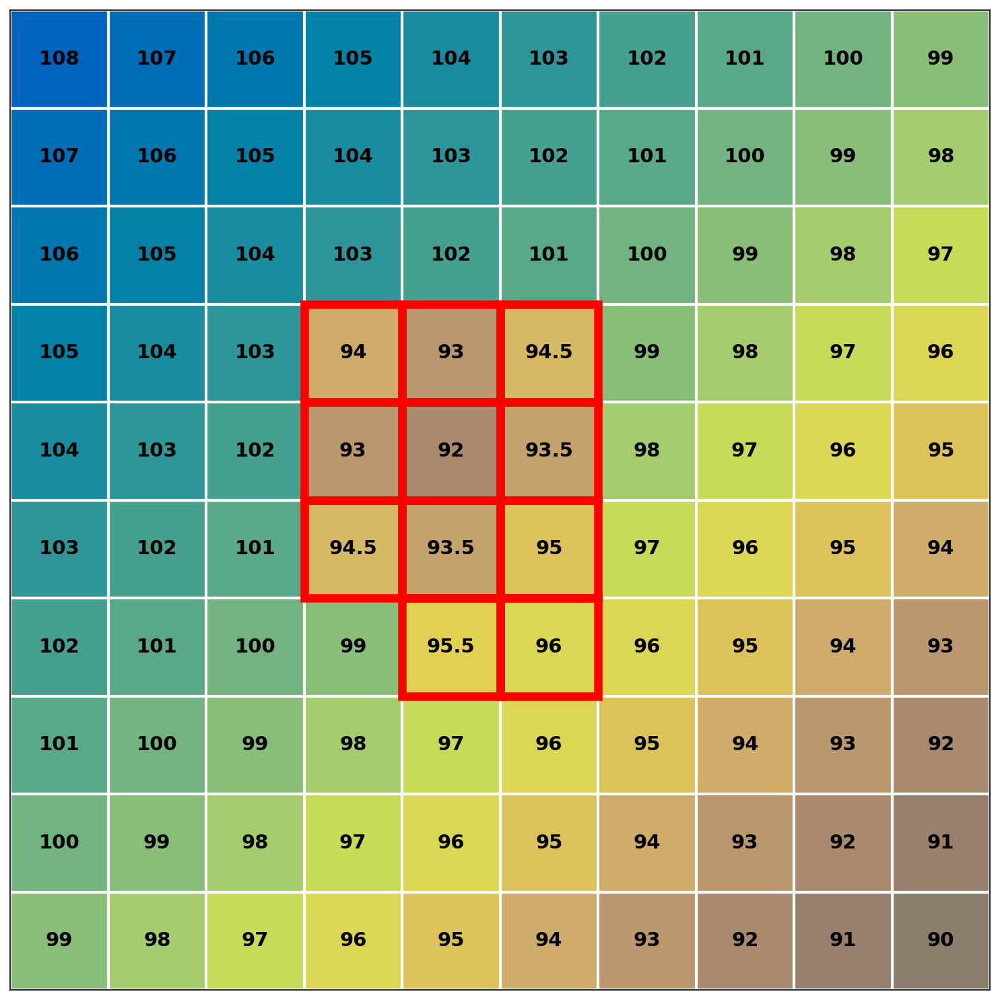
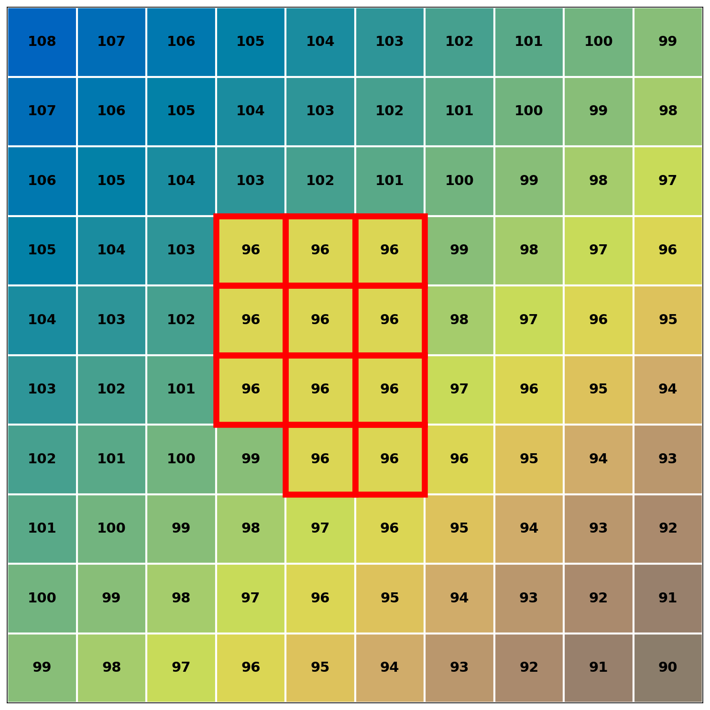

# Fill Algorithm

## Overview

The fill algorithm eliminates depressions by raising cell elevations to the lowest pour point. It implements the **Priority-Flood** algorithm, a well-established technique for depression filling in digital elevation models.

## References

- Barnes, R., Lehman, C., Mulla, D. (2014). "Priority-Flood: An Optimal Depression-Filling and Watershed-Labeling Algorithm for Digital Elevation Models." *Computers & Geosciences*, 62, 117-127. [arXiv:1511.04463](https://arxiv.org/abs/1511.04463)

- Barnes, R. (2016). "Parallel Priority-Flood Depression Filling For Trillion Cell Digital Elevation Models On Desktops Or Clusters." *Computers & Geosciences*, 96, 56-68. [arXiv:1606.06204](https://arxiv.org/abs/1606.06204)

## Core Concept

The Priority-Flood algorithm processes cells in order of elevation, starting from the DEM boundary and working inward. Each cell is assigned a label identifying its watershed, and depressions are filled by raising cells to the elevation of their pour point.

## Data Structures

| Structure | Description |
|-----------|-------------|
| Priority Queue | Min-heap ordered by elevation, stores boundary cells |
| Pit Queue | FIFO queue for cells within depressions |
| Labels Array | Integer grid assigning each cell to a watershed |
| Watershed Graph | Adjacency structure storing spillover elevations between watersheds |

## Algorithm

### Initialization

1. Create an empty labels array (all zeros)
2. Add all boundary cells to the priority queue with their elevations
3. Nodata boundary cells receive priority $-\infty$

### Main Loop

The algorithm maintains two queues: a priority queue (ordered by elevation) and a pit queue (FIFO). The pit queue takes precedence to ensure depressions are fully processed before moving to higher terrain.

```python
def priority_flood(dem, labels):
    priority_queue = MinHeap()
    pit_queue = Queue()
    graph = WatershedGraph()
    next_label = 2  # Reserve 1 for edge label

    # Initialize with boundary cells
    for cell in boundary_cells(dem):
        if is_nodata(cell):
            priority_queue.push((-infinity, cell))
        else:
            priority_queue.push((dem[cell], cell))

    while not priority_queue.empty() or not pit_queue.empty():
        # Pit queue has priority
        if not pit_queue.empty():
            current = pit_queue.pop()
        else:
            current = priority_queue.pop()

        # Assign label if unlabeled
        if labels[current] == 0:
            labels[current] = next_label
            next_label += 1

        for neighbor in neighbors_8(current):
            if labels[neighbor] != 0:
                # Record watershed adjacency
                spill_elev = max(dem[current], dem[neighbor])
                graph.add_edge(labels[current], labels[neighbor], spill_elev)
                continue

            # Assign same label to neighbor
            labels[neighbor] = labels[current]

            if dem[neighbor] <= dem[current]:
                # Neighbor is in depression - add to pit queue
                dem[neighbor] = dem[current]  # Fill to current elevation
                pit_queue.push(neighbor)
            else:
                # Neighbor is higher - add to priority queue
                priority_queue.push((dem[neighbor], neighbor))

    return labels, graph
```

### Watershed Graph

The watershed graph $G = (V, E)$ represents connectivity between labeled regions:

- **Vertices** $V$: Watershed labels
- **Edges** $E$: Pairs of adjacent watersheds with spillover elevation

For adjacent watersheds $w_1$ and $w_2$, the spillover elevation is:

$$
z_{\text{spill}}(w_1, w_2) = \min_{c_1 \in w_1, c_2 \in w_2, c_1 \sim c_2} \max(z_{c_1}, z_{c_2})
$$

where $c_1 \sim c_2$ denotes 8-connected adjacency.

## Tiled Processing

For DEMs exceeding available memory, the algorithm uses a three-phase approach based on Barnes (2016):

### Phase 1: Local Fill

Process each tile independently:

1. Run Priority-Flood on the tile
2. Extract perimeter cells (labels and elevations)
3. Build local watershed graph

### Phase 2: Graph Connection

Connect tiles by examining shared boundaries:

For adjacent tiles $A$ and $B$ sharing an edge, for each pair of adjacent perimeter cells $(a, b)$ where $a \in A$ and $b \in B$:

$$
\text{graph.add\_edge}(\text{label}_a, \text{label}_b, \max(z_a, z_b))
$$

Corner connections follow the same principle for tiles sharing only a corner cell.

### Phase 3: Graph Solving

Determine the minimum fill elevation for each watershed label using a modified Priority-Flood on the graph structure:

```python
def solve_graph(graph):
    min_elevation = {}
    queue = MinHeap()

    # Start from edge label (connected to boundary)
    queue.push((-infinity, EDGE_LABEL))

    while not queue.empty():
        elev, label = queue.pop()

        if label in min_elevation:
            continue

        min_elevation[label] = elev

        for neighbor, spill_elev in graph.neighbors(label):
            if neighbor not in min_elevation:
                new_elev = max(elev, spill_elev)
                queue.push((new_elev, neighbor))

    return min_elevation
```

### Phase 4: Elevation Raising

Apply the solved elevations to each tile:

$$
z'_c = \max(z_c, z_{\min}(\text{label}_c))
$$

where $z_{\min}(w)$ is the minimum fill elevation for watershed $w$.

## Nodata Handling

Two modes are supported via the `fill_holes` parameter:

**fill_holes = False (default):**

- Nodata regions act as drainage outlets
- Contiguous nodata regions receive unique labels
- Boundary nodata cells added to priority queue with $-\infty$

**fill_holes = True:**

- Nodata cells are filled with the elevation of the lowest surrounding valid cell
- Useful for DEMs with data gaps that should be interpolated

## Properties

The filled DEM satisfies:

1. **No depressions**: Every cell has a monotonically non-increasing path to the boundary
2. **Minimal modification**: Cells are only raised, never lowered
3. **Elevation preservation**: Cells not in depressions retain original values

Formally, for output elevation $z'$:

$$
z'_c \geq z_c \quad \forall c
$$

$$
\forall c \in \text{interior}: \exists n \in N(c) : z'_n \leq z'_c
$$

## Complexity

Let $n$ be the number of cells.

| Operation | Time Complexity | Space Complexity |
|-----------|-----------------|------------------|
| Priority-Flood | $O(n \log n)$ | $O(n)$ |
| Graph solving | $O(w \log w)$ | $O(w)$ |

Where $w$ is the number of distinct watersheds (typically $w \ll n$).

For tiled processing with $t$ tiles of size $s \times s$:

- Per-tile: $O(s^2 \log s^2)$
- Graph connection: $O(t \cdot s)$ (perimeter size)
- Total: $O(n \log s + t \cdot s)$

## Visual Example

| Before Fill | After Fill |
|:-------------:|:------------:|
|  |  |

The depression (highlighted in red) contains cells with elevations ranging from 94.0 to 96.8. The pour point elevation is 97.0. After filling, all depression cells are raised to the pour point elevation, ensuring water can flow out of the depression without encountering lower cells.
