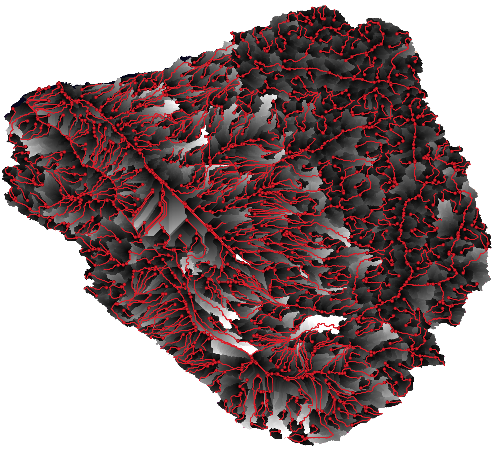

# Longest Flow Path

## Purpose

Flow length computes upstream distance from each cell to its downstream drainage point along the flow network. Maximum flow length in each basin identifies the longest flow path, representing the hydraulically most distant point from the outlet.

## Parameters

### fdr_path
Path to flow direction raster. GDAL-readable format. Single band. UInt8 data type. Values 0-7 represent valid flow directions. Nodata value 9. All non-nodata cells must have defined flow directions.

### drainage_points_path
Path to drainage points vector file. Any GDAL-readable vector format. Must contain point geometries with unique FIDs. Points define basin outlets where flow length computation originates.

### output_raster
Path for flow length raster output. Written as GeoTIFF. Float32 data type. Values represent upstream flow distance in map units (meters for metric CRS, feet for US State Plane, etc.). Inherits projection and geotransform from flow direction input. Nodata value (-1).

### output_vector
Path for longest flow path vector output. Written as GeoPackage containing LineString geometries. Each line represents longest flow path for one basin traced from maximum flow length cell downstream to drainage point. When None, vector output not created.

### fac_path
Path to flow accumulation raster for drainage point snapping. When provided with nonzero `snap_radius`, drainage points are moved to cell with maximum accumulation within snap radius. Ensures points snap to stream channels. When None, no snapping performed.

### snap_radius
Snapping search radius in cells. When positive and `fac_path` provided, drainage points moved to maximum accumulation cell within radius. When 0, no snapping. Default 0.

### layer_name
Name of layer in vector file to read. When None, uses first layer. Relevant for multi-layer formats like GeoPackage.

## CLI Usage

```bash
overflow flow-length \
    --fdr fdr.tif \
    --drainage_points outlets.shp \
    --output_raster flow_length.tif \
    --output_vector longest_paths.gpkg
```

## Python API Usage

```python
import overflow

overflow.flow_length(
    fdr_path="fdr.tif",
    drainage_points_path="outlets.shp",
    output_raster="flow_length.tif",
    output_vector="longest_paths.gpkg"
)
```

The output raster will contain cell values representing the distance in map units (meters for geographic coordinate systems) along flow paths to the first downstream drainage point. Drainage point cells have value 0. Values increase monotonically following the flow paths upstream. Nodata cells in the flow direction propagate as nodata in the output

The output vector (when generated) contains one LineString feature per drainage point with vertices corresponding to cell centers along the flow path. The same spatial reference as the input is used and the paths are attributed with the feature IDs of the provided drainage points.

## Visualization

| Input DEM | Flow Length Output |
|:-----------------------:|:------------------------:|
|  |  |

## Drainage Point Snapping

Snapping corrects drainage point locations that fall slightly off stream channels due to digitization error or CRS mismatch.

Snapping requires accumulation raster with values representing upstream cell count. Without snapping, drainage points used at exact provided coordinates—may not correspond to stream channel locations.

## See Also

- [Flow Direction](../flow-routing/flow-direction.md) - Computing flow directions for flow length analysis
- [Basin Delineation](basins.md) - Delineating watersheds for flow length computation
- [Stream Extraction](streams.md) - Generating drainage points at stream junctions
- [Complete Pipeline](../pipeline.md) - End-to-end workflow
- [Flow Length Algorithm](../../algorithm-details/flow-length.md) - Implementation details