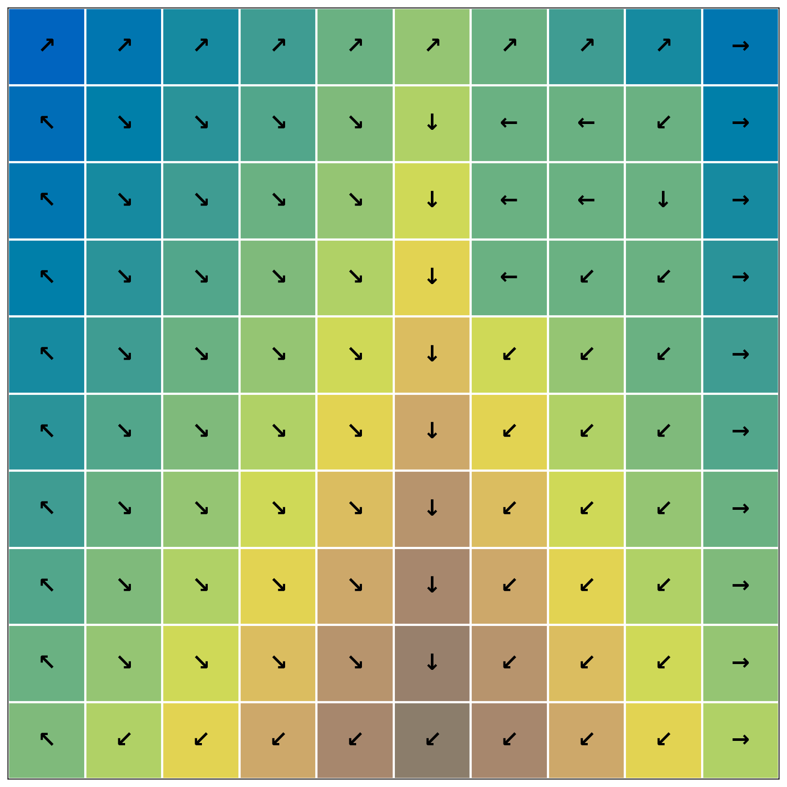
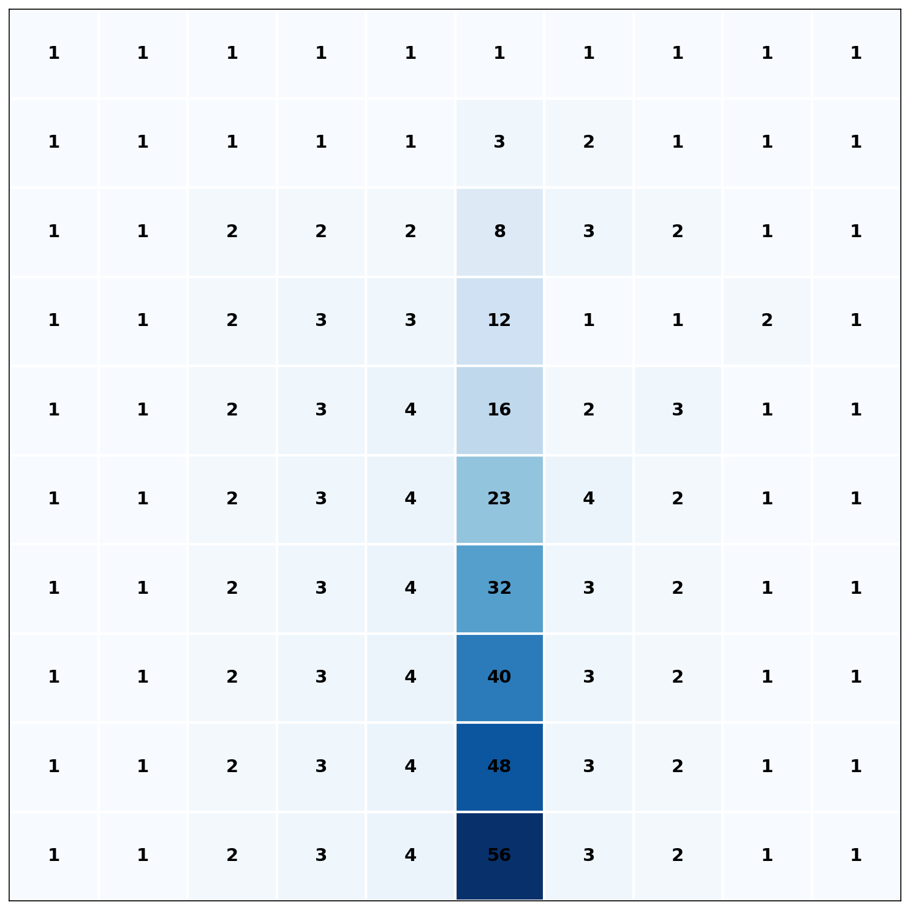

# Flow Accumulation

## Purpose

Flow accumulation computes upstream drainage area for each cell. Output value represents count of cells whose flow paths traverse the cell. Provides basis for stream network extraction.

## Parameters

### input_path
Path to flow direction raster. GDAL-readable format. Single band. UInt8 data type. Values 0-7 represent valid flow directions. Value 8 (undefined) not permitted (input must have all cells resolved). Value 9 (nodata) propagates to output.

### output_path
Path for accumulation output. Written as GeoTIFF. Int64 data type. Inherits projection and geotransform from input. Nodata value set to -1. Values represent upstream cell count including the cell itself (minimum value 1 for cells with no upstream contributors).

### chunk_size
Tile dimension in pixels. Default 2048. Set to 0 or 1 for in-memory processing.

### progress_callback
Optional callback for monitoring long operations. See [ProgressCallback API](../../api/index.md#overflow.ProgressCallback).

## CLI Usage

```bash
overflow accumulation \
    --input fdr.tif \
    --output accum.tif
```

## Python API Usage

```python
import overflow

overflow.accumulation(
    input_path="fdr.tif",
    output_path="accum.tif"
)
```

The output raster values represent the total upstream cell count including self. The minimum value is 1 and values monotonically increase following flow paths downstream. Nodata cells have value -1 and are propagated down from the input.

!!! note
    The flow direction raster MUST have all non-nodata cells contain valid defined flow directions (0-7) and must not contain cycles. These requirements are met automatically when using `flow_direction()` with `resolve_flats=True` on properly conditioned DEM.

## Visualization

| Input Flow Direction | Flow Accumulation Output |
|:--------------------:|:------------------------:|
|  |  |

The input shows flow direction arrows overlaid on terrain with a valley down the center. Arrows converge toward the valley (↓) from both sides (↘ and ↙). The flow accumulation output shows how many upstream cells drain through each location. Higher values (darker blue) indicate greater drainage area, with the valley channel collecting flow from both sides. The pattern clearly identifies potential stream locations where accumulation values are highest.

## See Also

- [Flow Direction](flow-direction.md) - Computing flow directions before accumulation
- [Stream Extraction](../feature-extraction/streams.md) - Using accumulation to extract streams
- [Basin Delineation](../feature-extraction/basins.md) - Delineating watersheds from flow network
- [Complete Pipeline](../pipeline.md) - End-to-end workflow
- [Flow Accumulation Algorithm](../../algorithm-details/flow-accumulation.md) - Implementation details