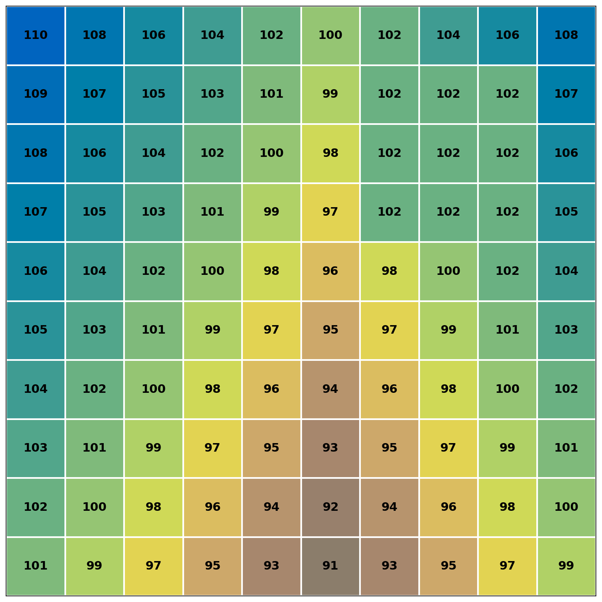
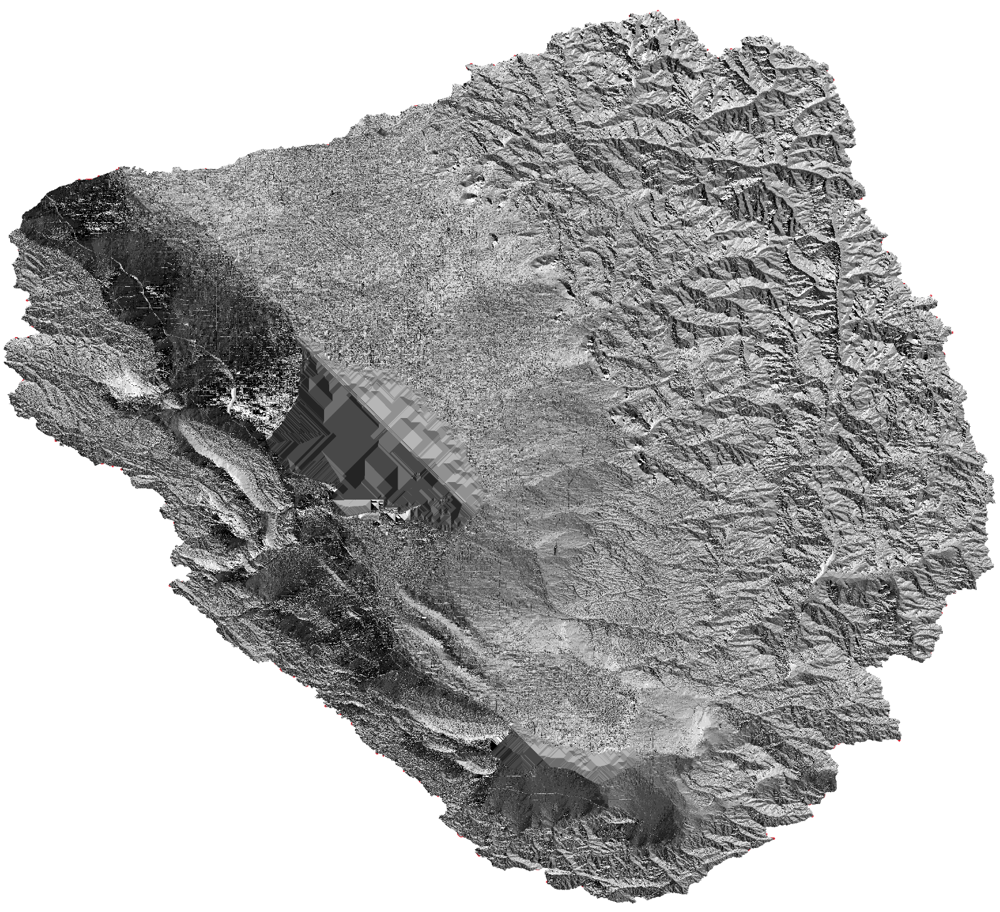

# Flow Direction and Flat Resolution

## Purpose

Flow direction assigns each cell a D8 direction code indicating steepest descent to one of eight neighbors. Flat resolution eliminates undefined flow in flat regions by computing gradients away from higher terrain and toward lower terrain.

## Flow Direction Encoding

Output raster uses byte encoding:

| Value | Direction | Offset (col, row) |
|-------|-----------|-------------------|
| 0 | East | (1, 0) |
| 1 | Northeast | (1, -1) |
| 2 | North | (0, -1) |
| 3 | Northwest | (-1, -1) |
| 4 | West | (-1, 0) |
| 5 | Southwest | (-1, 1) |
| 6 | South | (0, 1) |
| 7 | Southeast | (1, 1) |
| 8 | Undefined | - |
| 9 | Nodata | - |

See [FlowDirection](../../api/index.md#overflow.FlowDirection).

Direction indices proceed counter-clockwise from East. Undefined cells occur in flat regions when flat resolution is disabled. Nodata cells inherit nodata status from input DEM.

## Parameters

### input_path
Path to conditioned DEM raster. GDAL-readable format. Single band. Float32. Must be hydrologically conditioned (filled) to prevent internal drainage.

### output_path
Path for flow direction output. Written as GeoTIFF. UInt8 data type. Inherits projection and geotransform from input. Nodata value set to 9.

### chunk_size
Tile dimension in pixels. Default 2048. Set to 0 or 1 for in-memory processing.

### working_dir
Directory for temporary files during flat resolution in tiled mode. Ignored for in-memory mode. When None, uses system temporary directory.

### resolve_flats
Boolean controlling flat resolution. Default True. When False, cells in flat regions assigned value 8 (undefined). When True, flat cells receive directions routing flow away from higher terrain and toward lower terrain. There will be no undefined cells.

### progress_callback
Optional callback for monitoring long operations. See [ProgressCallback API](../../api/index.md#overflow.ProgressCallback).

### flat_resolution_chunk_size_max
Maximum chunk size for flat resolution processing. Default 512. This parameter is only available in the Python API (not in the CLI) and provides advanced control over flat resolution performance.

When `chunk_size` exceeds this value, flat resolution will automatically use this smaller chunk size instead. This prevents performance issues in areas with large contiguous regions of undefined flow (such as large filled depressions or water bodies), where large chunks can significantly slow down processing.

!!! note "Advanced Python API Only"
    This parameter is intentionally not exposed in the CLI interface. It's an advanced feature that requires understanding of the performance implications of chunk size during flat resolution.

## CLI Usage

```bash
overflow flow-direction \
    --input dem_filled.tif \
    --output fdr.tif \
    --resolve-flats
```

## Python API Usage

Basic usage:

```python
import overflow

overflow.flow_direction(
    input_path="dem_filled.tif",
    output_path="fdr.tif",
    resolve_flats=True
)
```

Advanced usage with custom flat resolution chunk size (Python API only):

```python
import overflow

# For large DEMs with significant flat areas, you may want to use
# a larger chunk_size for flow direction computation but limit the
# chunk size during flat resolution to avoid performance degradation
overflow.flow_direction(
    input_path="dem_filled.tif",
    output_path="fdr.tif",
    chunk_size=2048,  # Large chunks for flow direction
    resolve_flats=True,
    flat_resolution_chunk_size_max=512  # Cap flat resolution chunks
)
```

In the output flow direction raster, every non-nodata cell with at least one lower neighbor has a defined flow direction (0-7). There will be no cycles in the flow direction raster. If `resolve_flats` is true, there will also be no undefined flow directions.

!!! note
    In order to guarantee the flow direction raster is free of undefined flow directions, you MUST provide a DEM with no sinks/pits (i.e., the `fill` process has been run) AND set `resolve_flats` to `True`.

## Visualization

| Input DEM | Flow Direction Output |
|:---------:|:---------------------:|
|  |  |

The input DEM shows elevation values sloping from upper-left (108) to lower-right (90). The flow direction output displays arrows indicating the D8 direction of steepest descent for each cell.

| Input DEM | Flow Direction Output |
|:---------:|:---------------------:|
|  |  |

## Performance Considerations

The tiled algorithm for flat resolution is the most computationally intensive process implemented in Overflow. Flow direction rasters with large contiguous areas of undefined flows (e.g., large filled depressions or water bodies) can have a significant performance hit if used with a large `chunk_size`.

By default, the `flat_resolution_chunk_size_max` parameter caps the chunk size used during flat resolution at 512 pixels, even if you specify a larger `chunk_size` for the initial flow direction computation. This provides a good balance between performance and memory usage for most use cases.

## See Also

- [Flow Accumulation](flow-accumulation.md) - Computing drainage area from flow directions
- [Fill Operation](../terrain-conditioning/fill.md) - Conditioning DEM before flow direction
- [Complete Pipeline](../pipeline.md) - End-to-end workflow
- [Flow Direction Algorithm](../../algorithm-details/flow-direction.md) - Implementation details
- [Flat Resolution Algorithm](../../algorithm-details/flat-resolution.md) - Implementation details